# Assembly instructions

Case: top parts

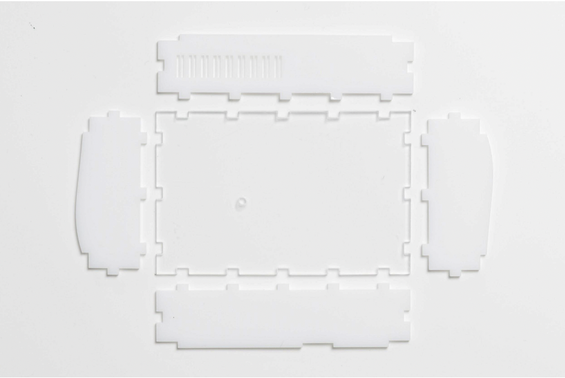

Case: top parts assembled

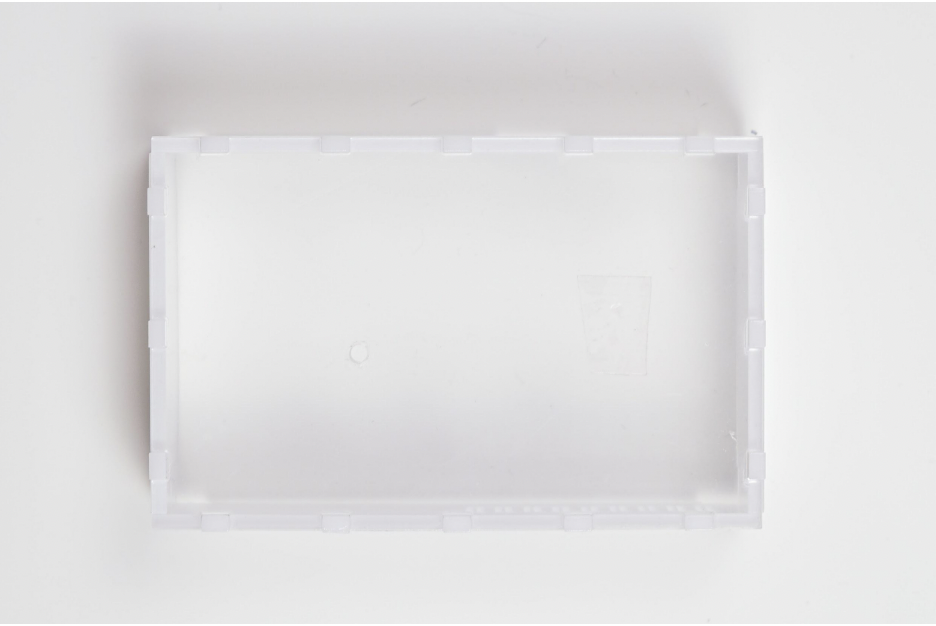

Case: bottom part

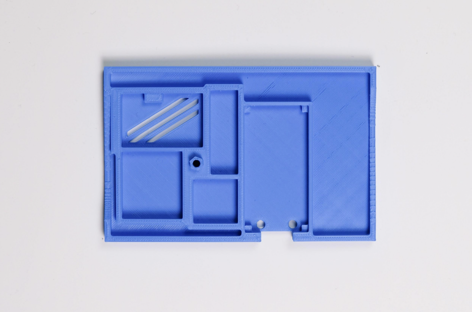

Connector cables

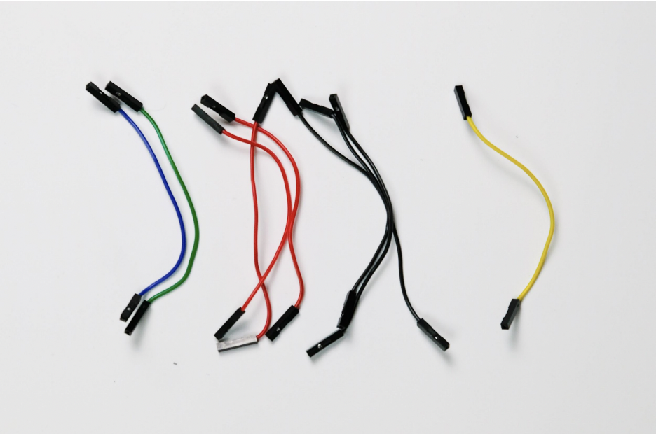

1 yellow cable
3 red cables
3 black cables
1 green cable
1 blue cable

Bridge Board

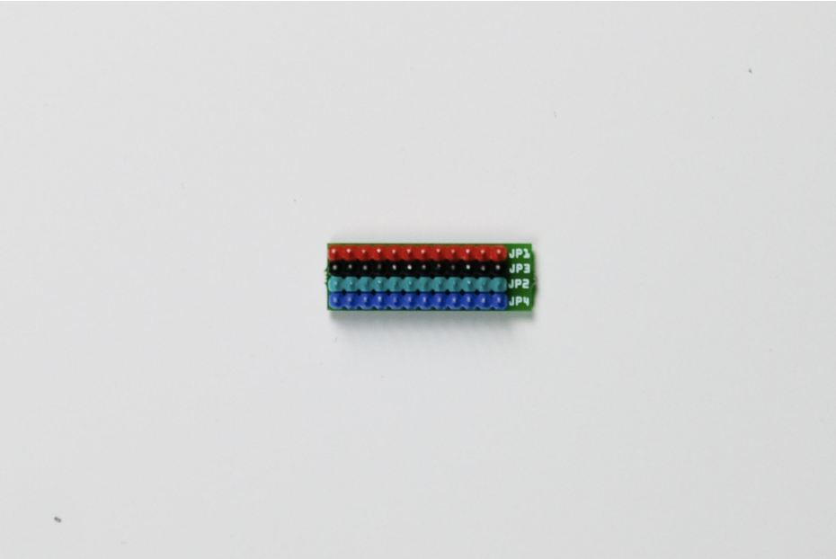

Install cables on bridge board

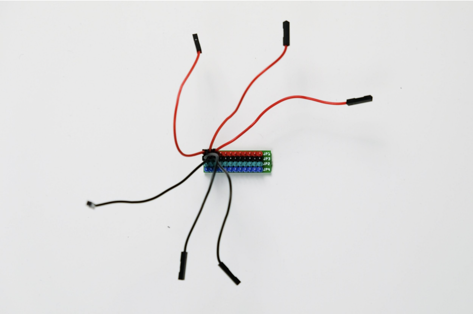

Place components on case bottom part

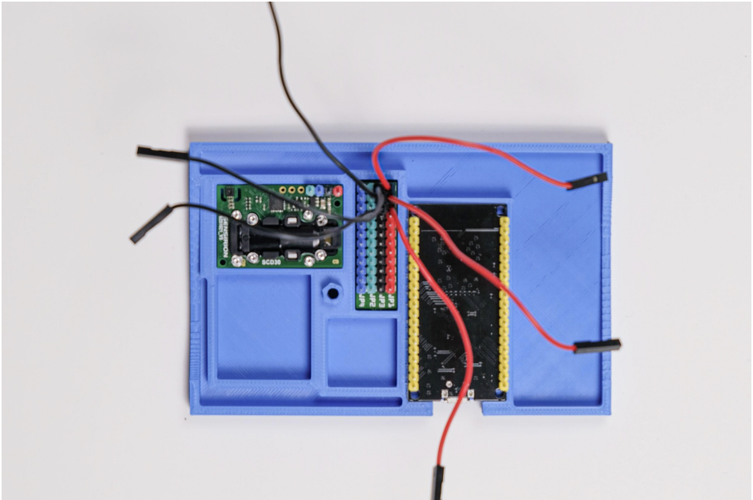

Install fixation plate

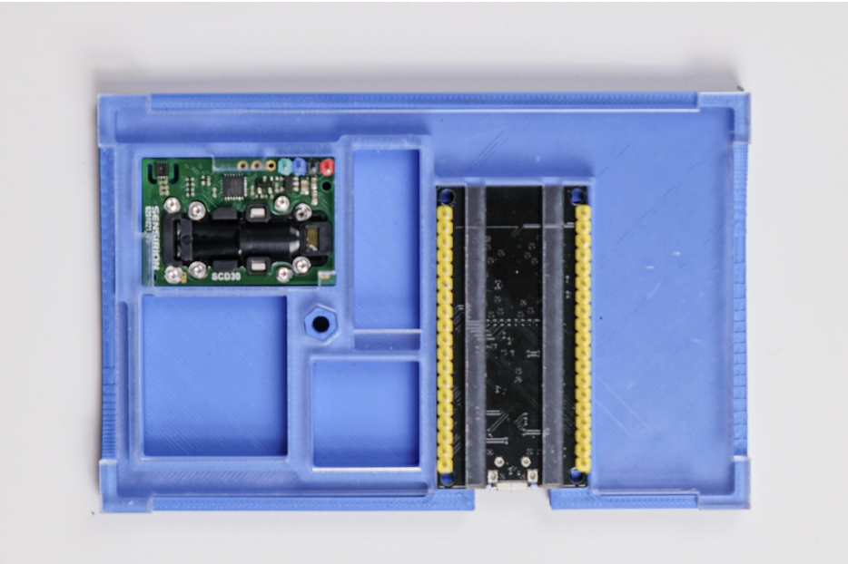

CPU-Board Pin Reference

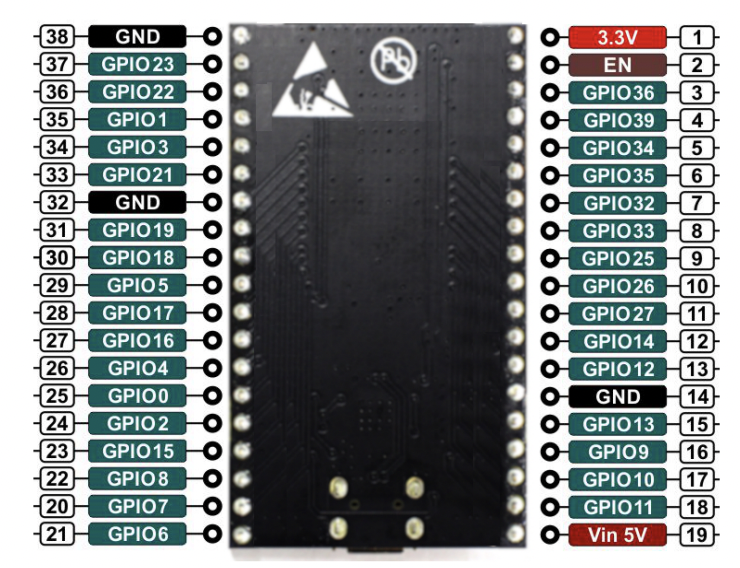

Connect red cables

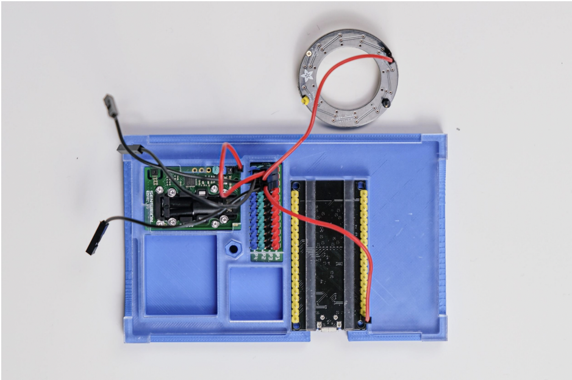

Connect black cables

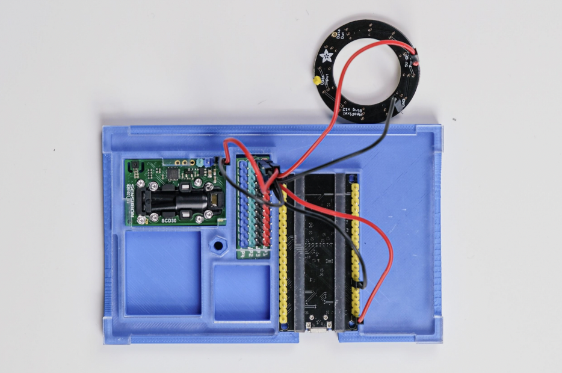

Connect yellow cable

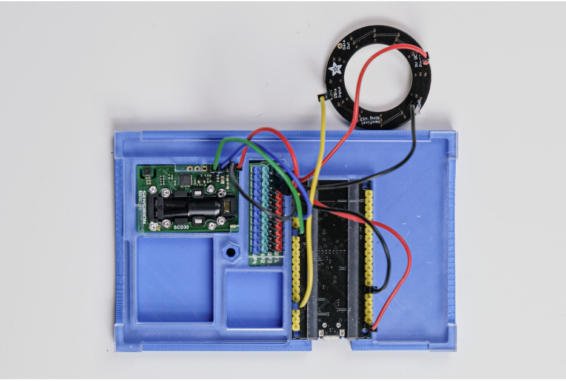

Connect blue cable

Connect green cable

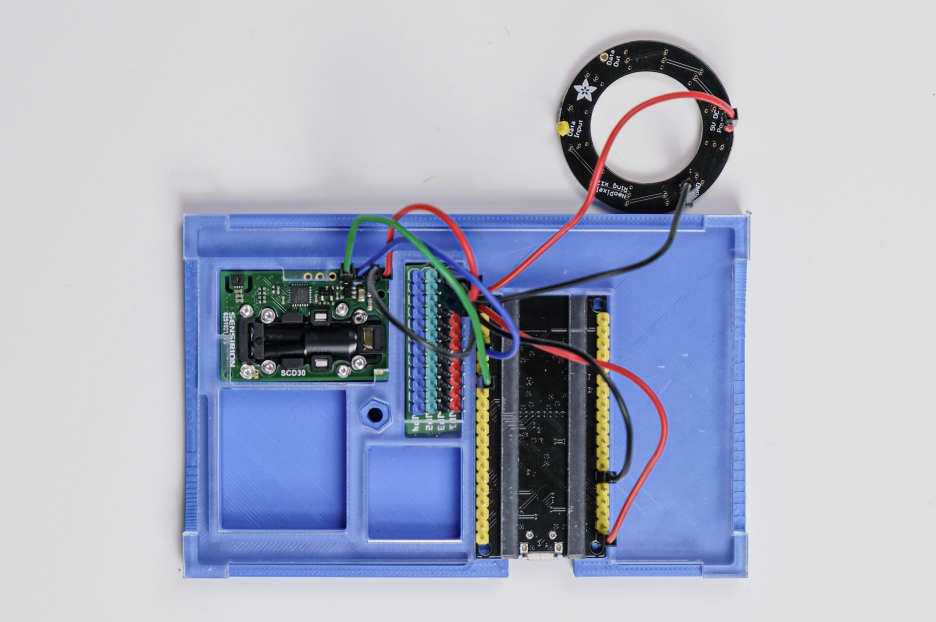

Double-sided tape

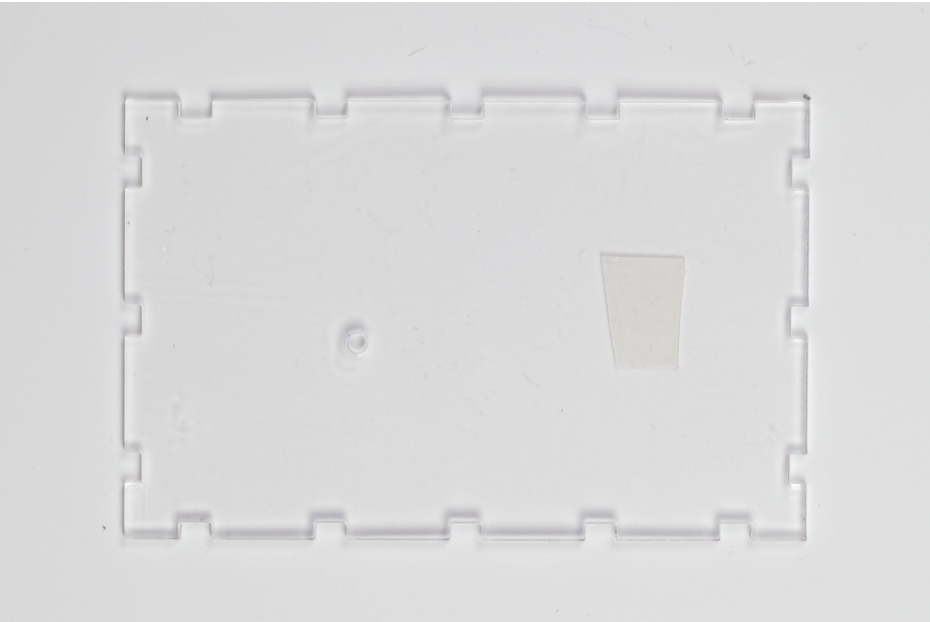

Attach LED Ring to case top

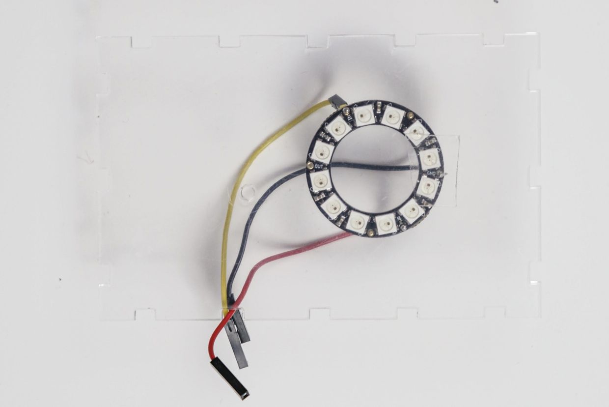

Finish by closing case with screw and nut

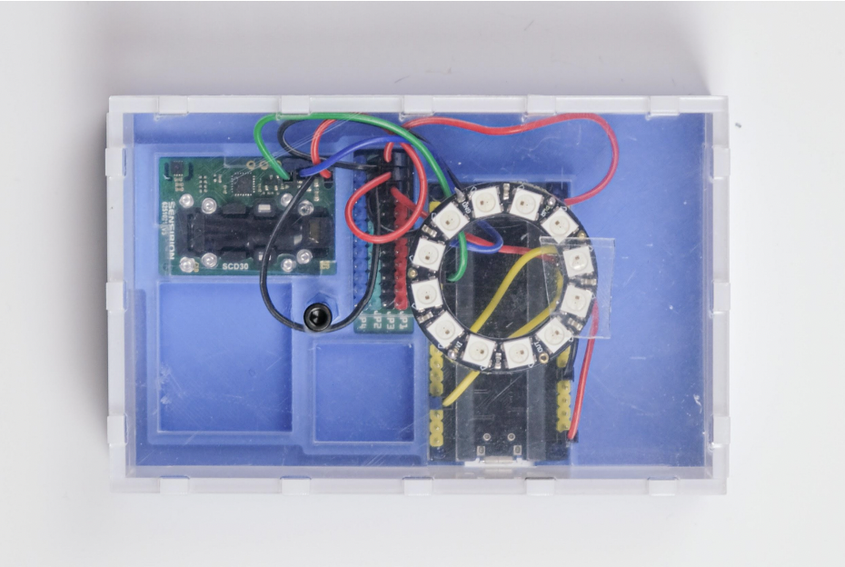
